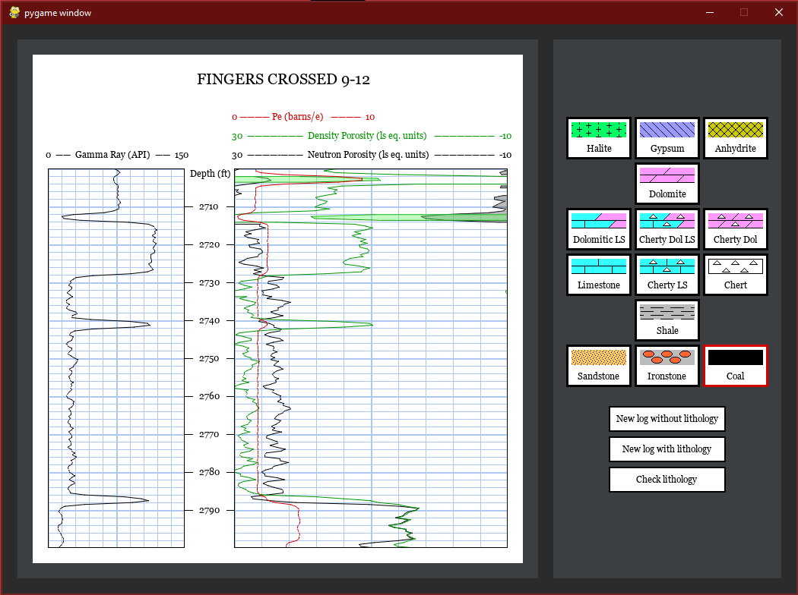
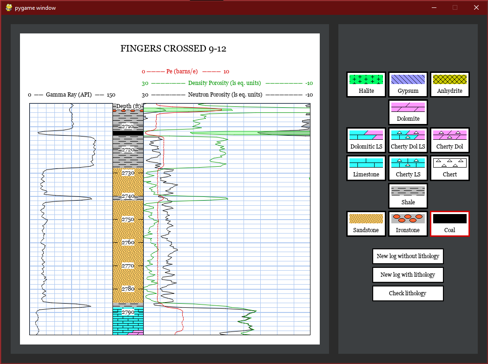

# OzMachine_python
 A recreation of Geoff Bohling's Oz Machine in python using pygame.
 
 Try your hand at interpreting rock types from wireline logs.  Given Gamma Ray, PE, Neutron Porosity, and Density Porosity logs interpret the lithology for each 2 foot section of the subsurface.
 
 
 
 
 
 The game uses the Markov Chain trained by Geoff Bohling to generate realistic syntethic lithology sequences.  More information can be found on their website at http://www.kgs.ku.edu/PRS/ReadRocks/MarkovSim.html.
 
 The original app can be found at - http://www.kgs.ku.edu/PRS/ReadRocks/OzIntro.html
 
 The figures and text were made by Geoff Bohling and John Doveton.
